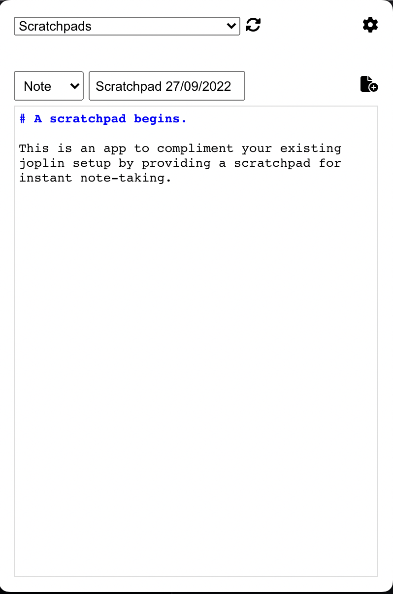
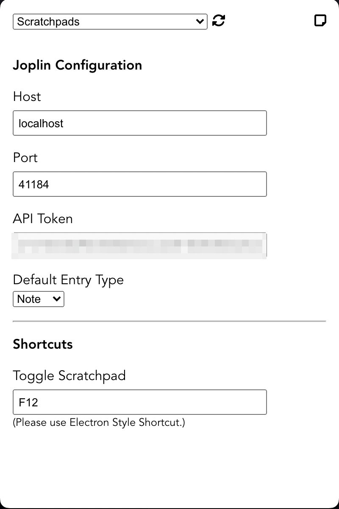

# Joplin Scratchpad

A scratchpad system tray app to quickly note in Joplin from MacOS and Linux system tray. PRs are welcome.

## Screenshots

## TODO
- [x] Better tray icons.
- [x] API Clean up.
- [x] Shortcuts